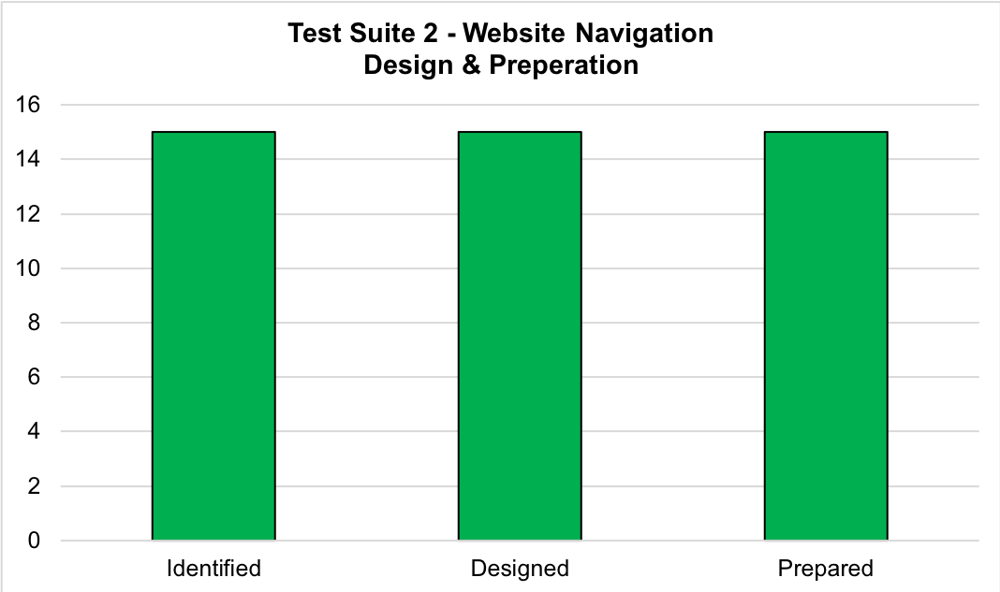
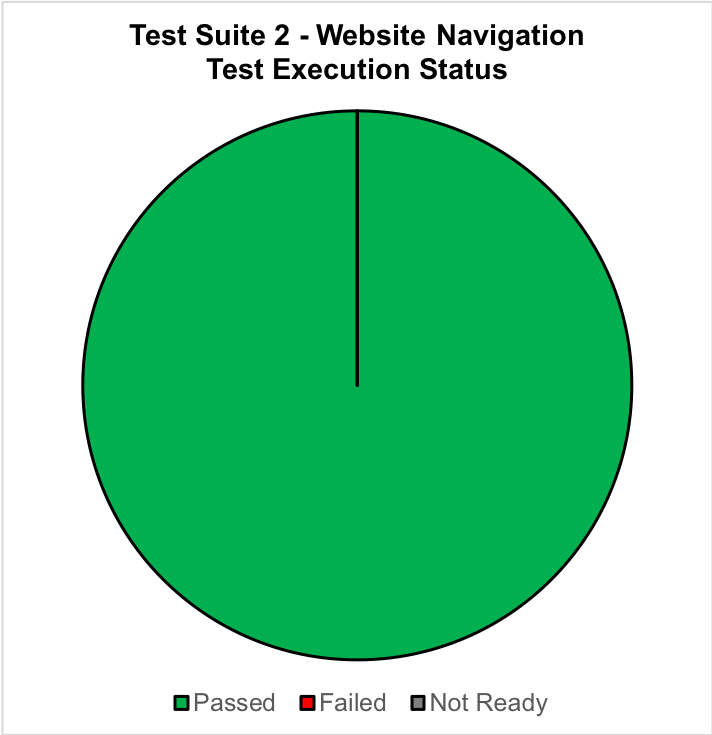

# Test Suite Report - Test Suite 2 - Website Navigation

**Date**: 12/01/2018  
**Report Source**: **Test Suite Living Documentation**:  
 
https://github.com/njgibbon/pareture-test/blob/master/functional-test/front-end/website-navigation/TestSuite2-WebsiteNavigation.md  

## Test Suite desctription
**Test Phase**: 2 - Functional Test  
**Test Area**: Front End  

### Primary Goal: 

**1**: Showing that all navigation to internal and external links is sound.  

### Secondary Goal:

**1**: Use WebDriver Automation and screen-recording for evidence.  
This can then be cited as evidence in other test-suites.  
i.e the User Experience suite.  
 
**2**: As the application is small we can go through the entire sites functionality in a short period of time (< 1 min).  
We can re-run this and watch the execution for confidence / smoke / regression testing.  
 
**Suite Design Start Date**: 26/12/2018  
**Suite Preperation Start Date**: 26/12/2018  
**Suite Execution Start Date**: 12/01/2019  

## Test Preperation and Design Status

**Tests Identified**: **15**  
**Tests Designed**: 15  
**Tests Prepared**: 15  
 

## Test Execution Status
**Tests**: **15**  
**Passed**: 15  
**Failed**: 0  
**Not Ready***: 0  
 

